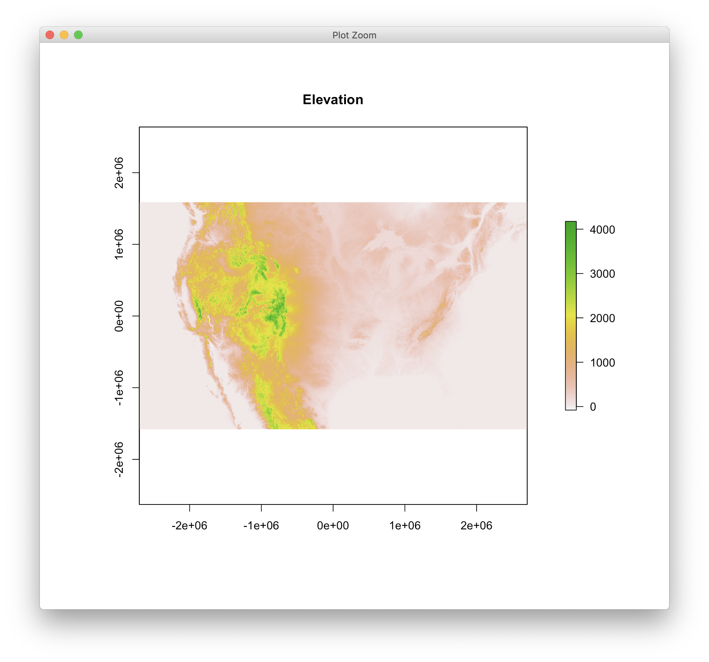
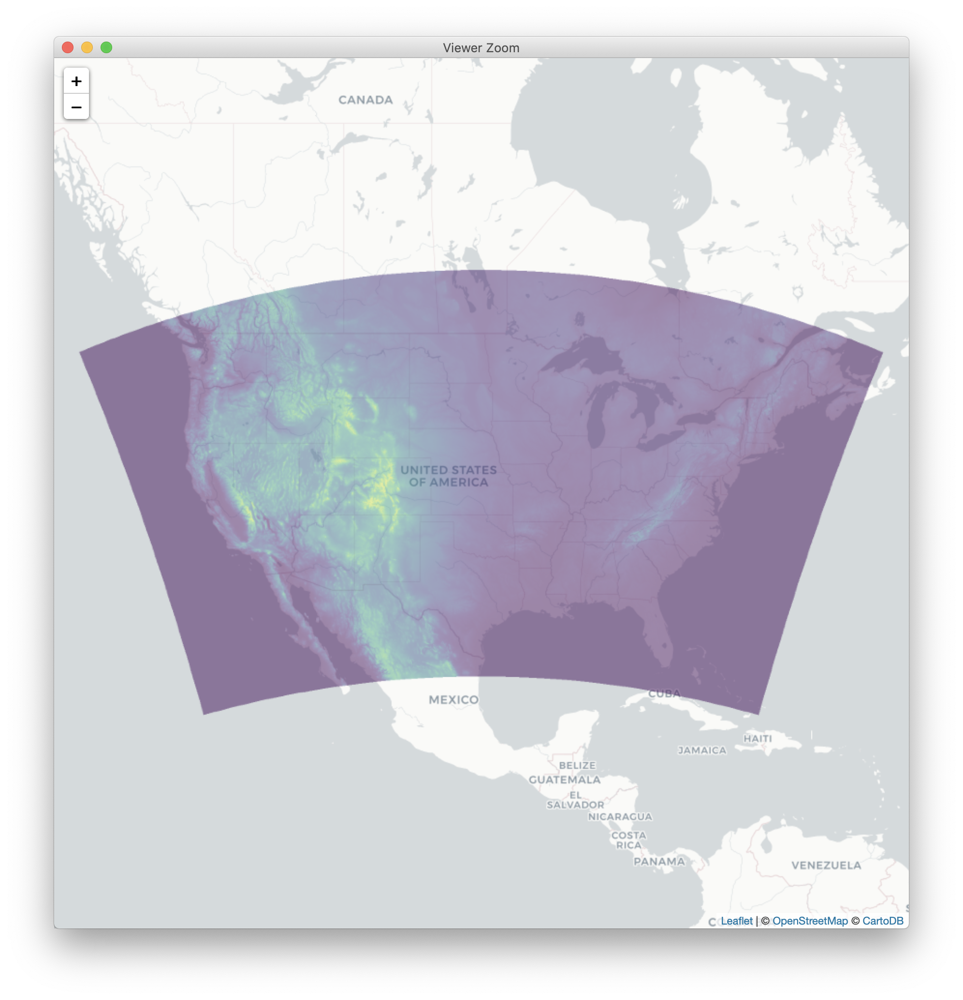

# stiltread R package

This package provides tools for interfacing with input and output files used by the [Stochastic Time Inverted Lagrangian Transport (STILT)](http://uataq.github.io/stilt) model.

## Installation

Package can be installed using `devtools`.

```r
if (!require('devtools')) install.packages('devtools')
devtools::install_github('uataq/stiltread')
```

Then, load the package and install the dependencies.

```r
library(stiltread)
install_dependencies()
```

To read a raster layer from a HRRR data file,

```r
library(stiltread)
shgt <- read_met('/path/to/arl/file.hrrra', 'shgt')
shgt
# class       : RasterLayer 
# dimensions  : 1059, 1799, 1905141  (nrow, ncol, ncell)
# resolution  : 3005.169, 2991.952  (x, y)
# extent      : -2700991, 2705308, -1580359, 1588118  (xmin, xmax, ymin, ymax)
# coord. ref. : +proj=lcc +lon_0=-97.5 +lat_0=38.5 +lat_1=38.5 +lat_2=38.5 +ellps=WGS84 +no_defs
# data source : in memory
# names       : layer 
# values      : -80.036, 4175.964  (min, max)
```

which returns a `raster::RasterLayer` containing data, grid coordinates, and projection information using the standard [PROJ4](https://proj4.org/) format.


## Visualizations

Since `read_met` returns a `raster::RasterLayer` with projection metadata, we can leverage standard mapping libraries in R.

```r
plot(shgt, main = 'Elevation')
```

<p align="center">
  
</p>

For an interactive leaflet map, 

```r
library(leaflet)
leaflet() %>%
  addProviderTiles('CartoDB.Positron') %>%
  addRasterImage(shgt, opacity = 0.5, colors = viridis::viridis(16))
```
<p align="center">
  
</p>
